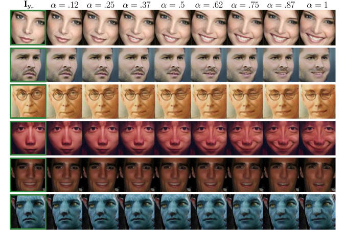

# GANimation: Anatomically-aware Facial Animation from a Single Image
### [[Project]](http://www.albertpumarola.com/research/GANimation/index.html)[ [Paper]](https://arxiv.org/abs/1807.09251) 
Official implementation of [GANimation](http://www.albertpumarola.com/research/GANimation/index.html). In this work we introduce a novel GAN conditioning scheme based on Action Units (AU) annotations, which describe in a continuous manifold the anatomical facial movements defining a human expression. Our approach permits controlling the magnitude of activation of each AU and combine several of them. For more information please refer to the [paper](https://arxiv.org/abs/1807.09251).

This code was made public to share our research for the benefit of the scientific community. Do NOT use it for immoral purposes.


## 工作的价值 Key Points
- 基于动作单元（AU）标注的GAN调节方案，在连续流形上定义人类表情的解剖学面部运动 (简言之:可以使生成的面部表情动作连续)
- 可以控制每个AU的激活并组合使用其中的几个来生成期望的表情变化
- 无监督训练模型,使用AU标注的图像,并用注意机制使网络对背景和光照变化鲁棒
- 


## 依赖项与Python环境 Prerequisites
- CentOS 7 
- Install CUDA, cuDNN 
- Install Python2.7 安装Python2.7
- Install PyTorch (version 0.3.1), Torch Vision and dependencies from http://pytorch.org
- Install requirements.txt (```pip install -r requirements.txt```) (更新了该文件，可以直接安装。)

## 数据准备 Data Preparation
The code requires a directory containing the following files:
- `imgs/`: folder with all image 所有图像.
- `aus_openface.pkl`: dictionary containing the images action units. 面部肌肉表情运动字典.
- `train_ids.csv`: file containing the images names to be used to train. 要训练的所有图像名字.
- `test_ids.csv`: file containing the images names to be used to test. 要测试的所有图像名字.

An example of this directory is shown in `sample_dataset/`.
这个目录下有一个样例。

To generate the `aus_openface.pkl` extract each image Action Units with [OpenFace](https://github.com/TadasBaltrusaitis/OpenFace/wiki/Action-Units) and store each output in a csv file the same name as the image. Then run:
```
python data/prepare_au_annotations.py
```

## 依次运行 Run
*由于版权问题，作者无权发布数据集，也没有分享生成的模型。如有需要，要自己获得数据、生成模型。*

To train:
```
bash launch/run_train.sh (也可以直接运行Python脚本 / also can run python file directly.)
```
举个具体的例子 Take an example ：
```
python train.py --data_dir /data/dl_code/GANimation/sample_dataset --name experiment_1 --batch_size 25
```

To test:
```
python test --input_path path/to/img
```
举个具体的例子 Take an example ：
```
python test.py --input_path /data/dl_code/GANimation/sample_dataset/imgs/N_0000000356_00190.jpg
```

## 原理学习与数据标注  Principle & Annotation

### 面部动作编码系统 FACS ()

面部表情是面部肌肉的组合协调动作的结果,面部动作编码系统（FACS）根据动作单元（AU）来描述面部表情, 动作单元在解剖学上与特定面部肌肉的收缩相关。

单个图像的面部动画;最左侧的输入图像Iyr(绿色方块), 参数α控制微笑表情的目标动作单元的激活程度.

```
目标: 构建一个合成面部动画的模型，具有面部动作编码系统FACS的表现能力 & 能够在解剖学表情表达层面连续生成 & 无需任何面部标志.  
```


## 遵守协议,表示尊重,添加引用 Citation
If you use this code or ideas from the paper for your research, please cite our paper:
```
@inproceedings{pumarola2018ganimation,
    title={GANimation: Anatomically-aware Facial Animation from a Single Image},
    author={A. Pumarola and A. Agudo and A.M. Martinez and A. Sanfeliu and F. Moreno-Noguer},
    booktitle={Proceedings of the European Conference on Computer Vision (ECCV)},
    year={2018}
}
```

## 参考文献 Reference

1. [论文阅读：GANimation: Anatomically-aware Facial Animation from a Single Image](https://blog.csdn.net/tobale/article/details/83587140)

2. 